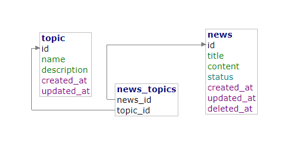

## Backend test from zero one group

### TODO
- still so lack of error handling

### Database Design


### How to
- still in dev environment
    - git clone https://github.com/sulthonuladib/news-rest
    - cd news-rest
    - npm install
    - npm build:dev || or straight npm build && npm start:prod
    - open new terminal session
    - npm start:dev

### API Docs
 DEV_URL = localhost:3000/<br>
 theres 3 endpoint which is
 - /api/news/
 - /api/topics/
 - /api/news-topics


#### News Endpoint
- Get All News
    - path: /api/news
    - method: GET
    - response:
     ```json
     {
        message: success,
        data: [
            {
                id: 1,
                title: string,
                content: string,
                status: enum['published', 'draft', 'deleted']
            },
            {
                id: 2,
                title: string,
                content: string,
                status: enum['published', 'draft', 'deleted']
            }
        ]
    }
    ```

- Get News by Id
    - path: /api/news/{id}
    - method: GET
    - response:
     ```json
     {
        message: success,
        data: [
            {
                id: 1,
                title: string,
                content: string,
                status: enum['published', 'draft', 'deleted']
            }
        ]
    }
    ```

- Create News
    - path: /api/news
    - method: POST
    - body: 
     ```json
     {
        title: string,
        content: string,
        status: enum['published', 'draft', 'deleted']
     }
    ```
    - response:
     ```json
     {
        message: 'News created',
        data: [
            {
                id: 1,
                title: string,
                content: string,
                status: enum['published', 'draft', 'deleted']
            }
        ]
    }
    ```

- Get All News By Status
    - path: /api/news/status/{status}
    - method: GET
    - response:
     ```json
     {
        message: success,
        data: [
            {
                id: 1,
                title: string,
                content: string,
                status: enum['published', 'draft', 'deleted']
            },
            {
                id: 2,
                title: string,
                content: string,
                status: enum['published', 'draft', 'deleted']
            }
        ]
    }
    ```

- Get All News By Status
    - path: /api/news/status/{status}
    - method: GET
    - response:
     ```json
     {
        message: success,
        data: [
            {
                id: 1,
                title: string,
                content: string,
                status: enum['published', 'draft', 'deleted']
            },
            {
                id: 2,
                title: string,
                content: string,
                status: enum['published', 'draft', 'deleted']
            }
        ]
    }
    ```

- Update News
    - path: /api/news/{id}
    - method: PUT
    - body: 
     ```json
     {
        title?: string,
        content?: string,
        status?: enum['published', 'draft', 'deleted']
     }
    ```
    - response:
     ```json
     {
        message: 'News updated',
        data: [
            {
                id: number,
                title: string,
                content: string,
                status: enum['published', 'draft', 'deleted']
            }
        ]
    }
    ```

- Delete News
    - path: /api/news/{id}
    - method: DELETE
    - body: 
    - response:
     ```json
     {
        message: 'News deleted',
        data: null    
     }
    ```

# Topic Endpoint
- Get All Topics
    - path: /api/topics
    - method: GET
    - response:
     ```json
     {
        message: success,
        data: [
            {
                id: number,
                name: string,
                description: string,
            },
            {
                id: 2,
                title: string,
                content: string,
                status: enum['published', 'draft', 'deleted']
            }
        ]
    }
    ```

- Get topic by Id
    - path: /api/topic/{id}
    - method: GET
    - response:
     ```json
     {
        message: success,
        data: [
            {
                id: 1,
                title: string,
                content: string,
                status: enum['published', 'draft', 'deleted']
            }
        ]
    }
    ```

- Update topic
    - path: /api/topic/{id}
    - method: PUT
    - body: 
     ```json
     {
        name?: string,
        description?: string,
     }
    ```
    - response:
     ```json
     {
        message: 'Topic updated',
        data: [
            {
                id: number,
                name: string,
                description: string,
            }
        ]
    }
    ```

- Delete topic
    - path: /api/topic/{id}
    - method: DELETE
    - body: 
    - response:
     ```json
     {
        message: 'topic deleted',
        data: null    
     }
    ```

#### News-Topic endpoint
to manager between topic and news

- Add Topic to News
    - path: /api/news-topic/
    - method: POST
    - body: 
        ```json
        {
            news_id: number,
            topic_id: number
        }
        ```
    - response:
        ```json
        {
            message: 'Topic Added to news',
            data: {
                id: number,
                title: string,
                status: enum['published', 'draft', 'deleted'],
                created_at: date,
                updated_at: date,
                deleted_at: date,
                topics: [
                    {
                        id: number,
                        name: string,
                        description: string,
                    }
                ]
            }
        }
        ```


- Remove Topic from News
    - path: /api/news-topic/
    - method: DELETE
    - body: 
        ```json
        {
            news_id: number,
            topic_id: number
        }
        ```
    - response:
        ```json
        {
            message: 'Topic Deleted from news',
            data: {
                id: number,
                title: string,
                status: enum['published', 'draft', 'deleted'],
                created_at: date,
                updated_at: date,
                deleted_at: date,
                topics: [
                    {
                        id: number,
                        name: string,
                        description: string,
                    }
                ]
            }
        }
        ```
        